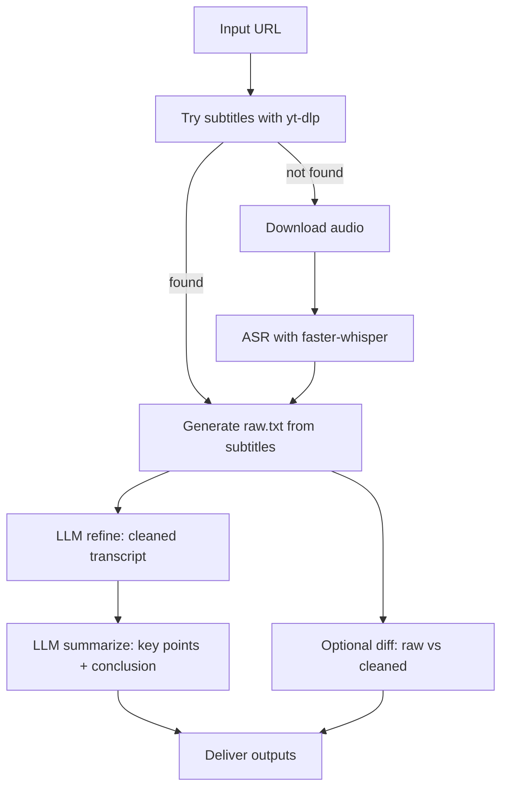

# Case A：从 YouTube 链接到可发布文本

> 用一个真实流水线具像化 Agent / Skill / Protocol / Chain（OpenClaw + PiClaw）

## TL;DR

在这个案例里：

- **Agent** 负责任务协调（拆分、分发、聚合）
- **Skill** 负责复用与稳定（把高频操作固化为 SOP）
- **协议层（Protocol）** 负责互操作与治理（结构化输入输出）
- **Chain/Workflow** 负责可观测与可复现（步骤化、可回放）

---

## 1. 背景与目标

我们需要把一个 YouTube 视频快速转换成可用文稿，并支持后续技术写作引用。

**输入**：YouTube URL  
**输出**：`raw.txt`、`cleaned.txt`、`summary.md`（可选 `diff`）

样本视频：

```text
https://youtu.be/O9b8tLXCTYU?si=FKVxNdX-w2FtilG2
```

---

## 2. 系统上下文

- Runtime：OpenClaw（`hq` 主协调）
- 执行机：PiClaw（本地 Python + `venv`）
- 处理策略：
  1) 优先尝试字幕；
  2) 无字幕则 ASR（Whisper）；
  3) 用更强模型做文本修正与精简。

---

## 3. Chain/Workflow：任务链定义



这条链说明：即使不使用 LangChain 框架，也可以具备完整的链式工程能力。

---

## 4. Agent：任务协调层（而非“神智能”）

`hq` 的核心职责不是“自己做完一切”，而是：

1. 接收目标（URL + 输出格式）
2. 触发本地转写流程（成本低、快）
3. 把“语义修正/精简”委托给更擅长文本编辑的模型
4. 回收结果并统一交付

伪代码：

```python
def run_case_a(url):
    raw = transcribe_locally(url)            # subtitle-first, ASR fallback
    cleaned = refine_with_llm(raw)           # spelling, punctuation, structure
    summary = summarize_with_llm(cleaned)    # key points + conclusion
    diff = build_diff(raw, cleaned)          # optional review artifact
    return {"raw": raw, "cleaned": cleaned, "summary": summary, "diff": diff}
```

---

## 5. Skill：复用与稳定层

把流程写成 Skill，可以避免每次重复口头描述，降低随机性。

目录建议：

```text
skills/youtube-transcriber/
  SKILL.md
  scripts/
    run.sh
    cleanup_prompt.md
```

`SKILL.md` 示例：

```md
---
name: youtube-transcriber
description: YouTube 转写与文本精修（字幕优先，ASR回退）
inputs:
  - url
  - out_dir (optional)
outputs:
  - raw_txt
  - cleaned_txt
  - summary_md
---

## Procedure
1. 尝试字幕提取；失败则 ASR
2. 产出 raw transcript
3. 调用文本修正（纠错+断句+术语统一）
4. 输出摘要与关键 diff

## Constraints
- 保留原意，不编造事实
- 统一术语：Agent / Skill / MCP / RAG / Workflow
```

---

## 6. 协议层（Protocol）：互操作与治理

协议层的重点不是“名字”，而是契约：

- 输入格式可验证
- 输出格式可消费
- 中间步骤可审计

### 6.1 Tool Schema（示意）

```json
{
  "name": "transcript.refine",
  "input_schema": {
    "type": "object",
    "properties": {
      "raw_path": {"type": "string"},
      "mode": {"type": "string", "enum": ["clean", "summary", "both"]}
    },
    "required": ["raw_path", "mode"]
  }
}
```

### 6.2 Call Payload（示意）

```json
{
  "tool": "transcript.refine",
  "args": {
    "raw_path": "/data/raw.txt",
    "mode": "both"
  }
}
```

### 6.3 Result Contract（示意）

```json
{
  "ok": true,
  "cleaned_txt": "/data/cleaned.txt",
  "summary_md": "/data/summary.md",
  "quality_notes": ["fixed ASR errors", "normalized terminology"]
}
```

---

## 7. 可运行实现（本地 venv）

项目目录（实际可执行）：

```text
~/Projects/youtube-transcriber/
  app/main.py
  app/fetch_subs.py
  app/transcribe.py
  app/formats.py
  output/
```

执行命令：

```bash
cd ~/Projects/youtube-transcriber
source .venv/bin/activate
python -m app.main "https://youtu.be/O9b8tLXCTYU?si=FKVxNdX-w2FtilG2" \
  --lang zh-Hans,zh,en \
  --model small \
  --out ./output \
  --format txt,srt,json
```

---

## 8. 观测结果与工程经验

在本案例中，真实出现了两个典型现象：

1. 视频无可用字幕，流程自动回退到 ASR；
2. ASR 初稿噪声较高，需二次 LLM 修正提升可读性。

这恰好说明了四层分工的必要性：

- 没有 Agent，很难自动协调多步任务；
- 没有 Skill，流程不可复用、每次都靠人工口述；
- 没有协议层，组件替换/审计会非常痛苦；
- 没有 Chain/Workflow，失败排查与复现成本极高。

---

## 9. 结论：概念不是互斥，而是分层

在真实系统里，**Agent / Skill / Protocol / Chain** 并不互相替代，而是分别承担：

- Agent：协调
- Skill：稳定复用
- Protocol：互操作治理
- Chain/Workflow：可观测可复现

所以比起“哪个词更先进”，更关键的问题是：

> 当前任务需要哪几层，才能在成本、稳定性和可维护性之间取得最优平衡？

---

## Appendix A：用于文章引用的一句话定义

- **Agent**：任务协调器，不是万能执行器。  
- **Skill**：可复用的流程说明与约束集合。  
- **Protocol**：工具调用的结构化契约。  
- **Chain/Workflow**：把任务拆成可回放步骤的执行模型。
